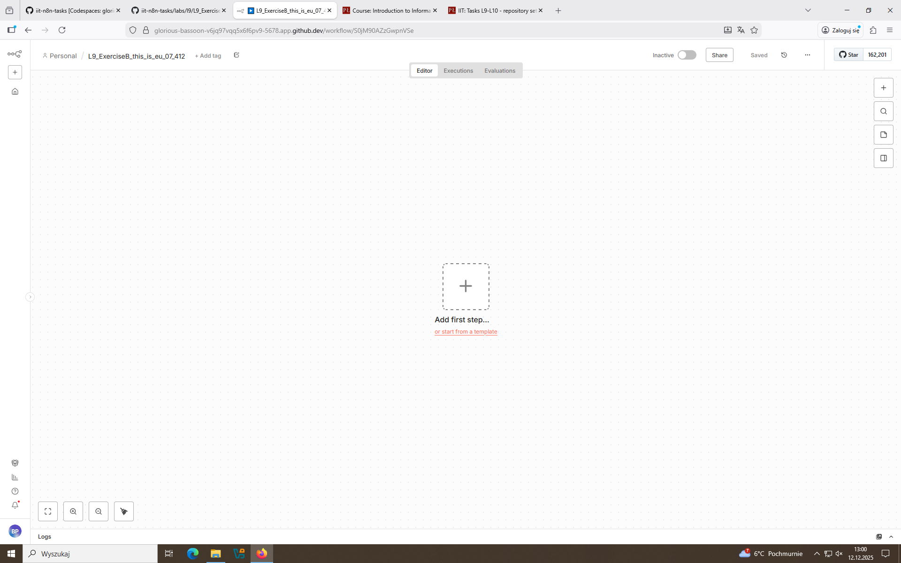
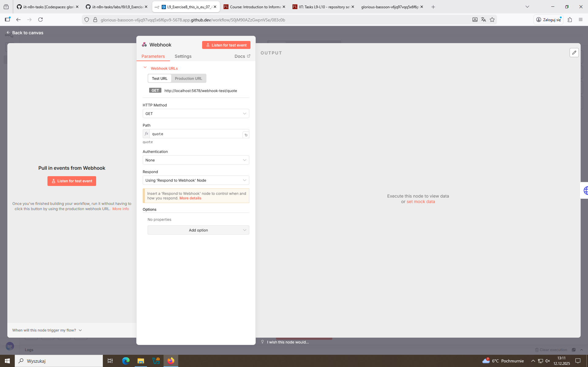
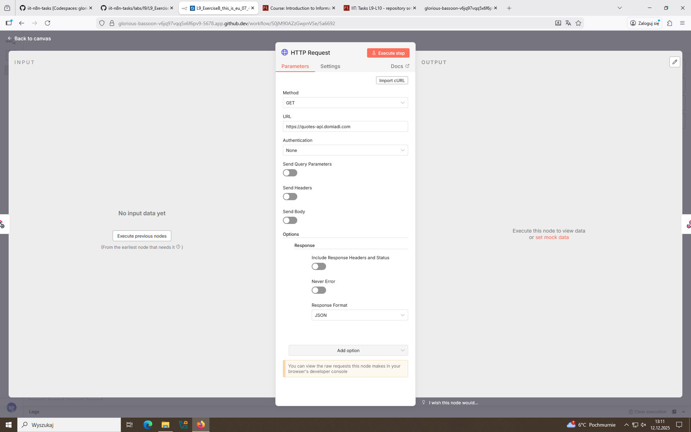
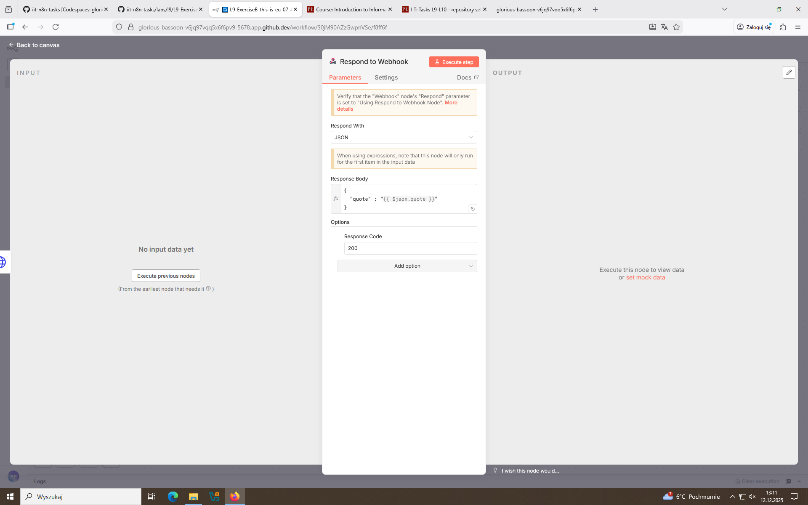
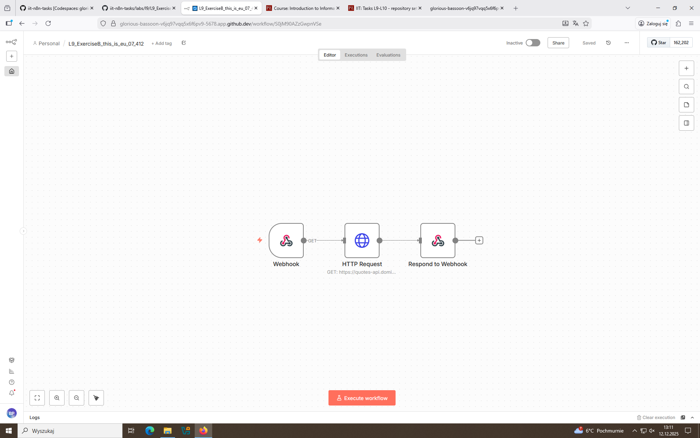
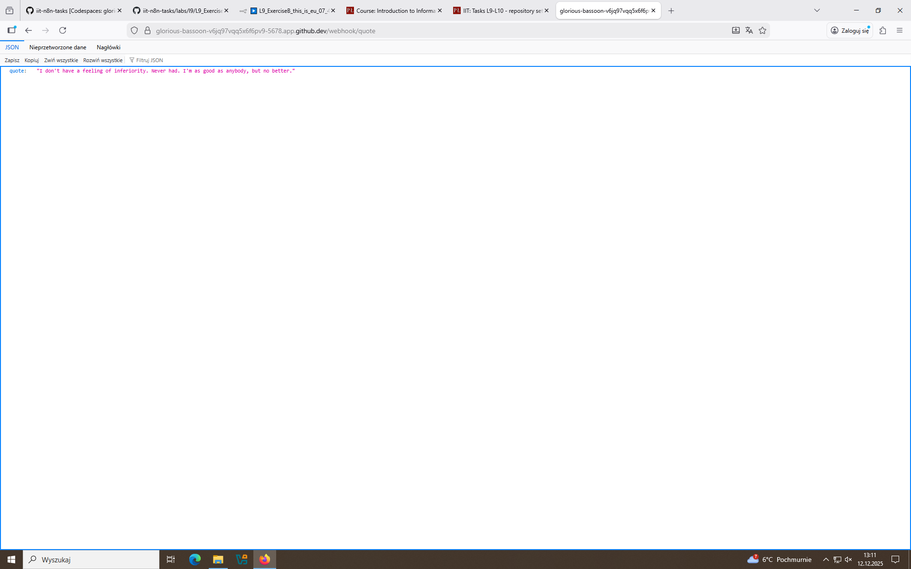

# Labolatories Week 9: Task B

## 1. Creating the workflow

- Just the same as previous task.

## 2. Setting up the nodes

- First webhook listens whether somebody used it's URL with quote path. Then http request is called to other website api which responds with JSON containing a random joke quote that is passed to respond to a webhook node and displayed in browser in it's unprocessed form. The response code in that case is 200.

## 3. Testing

- Result for workflow-test and active workflow.

