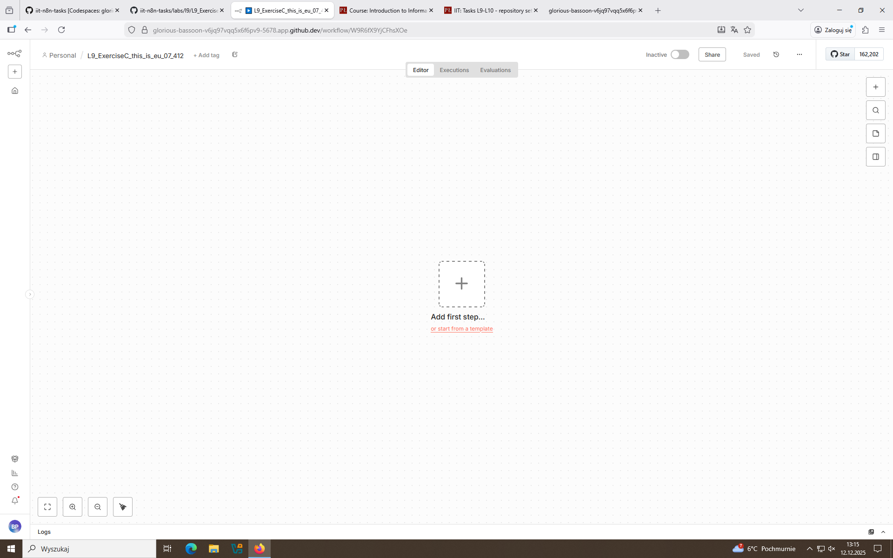
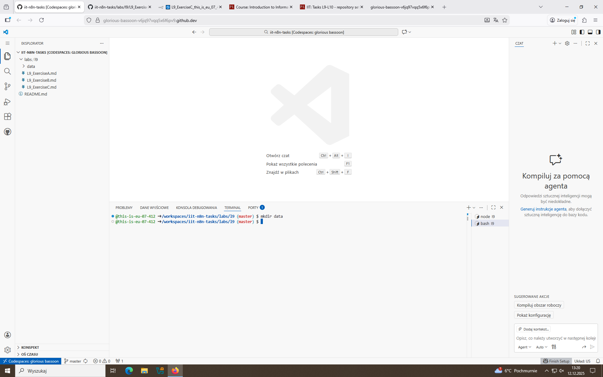
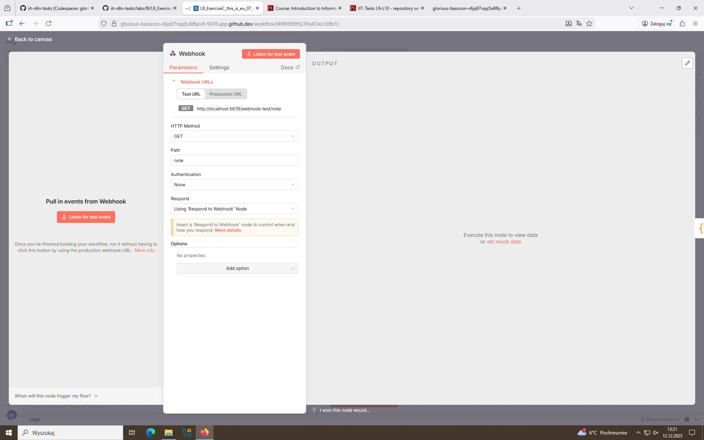
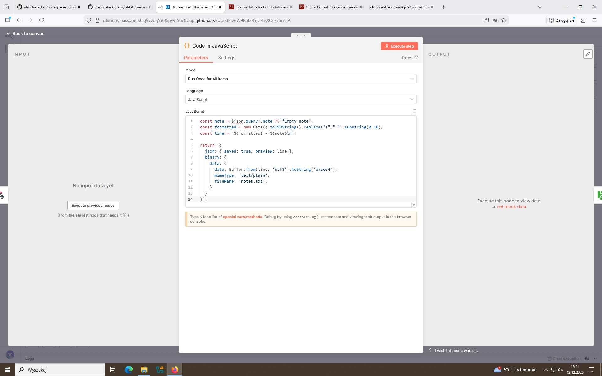
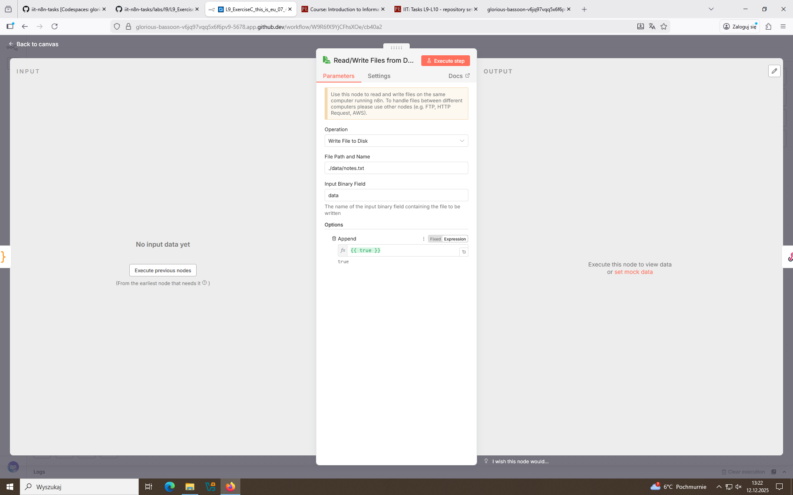
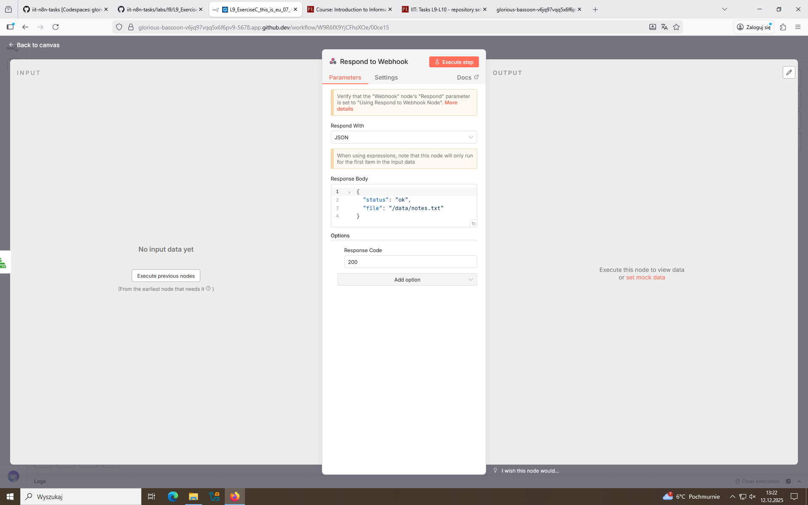
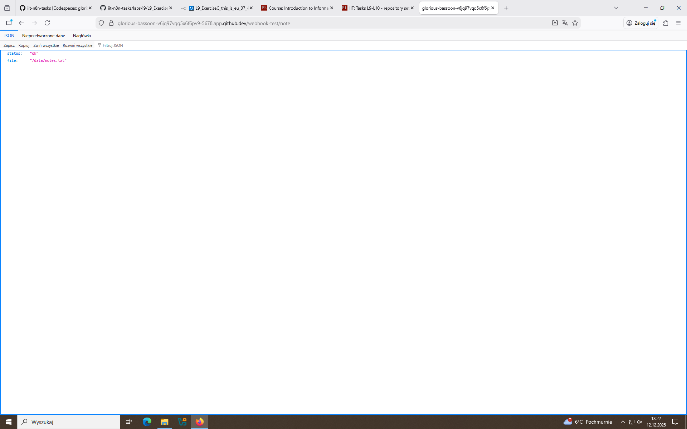
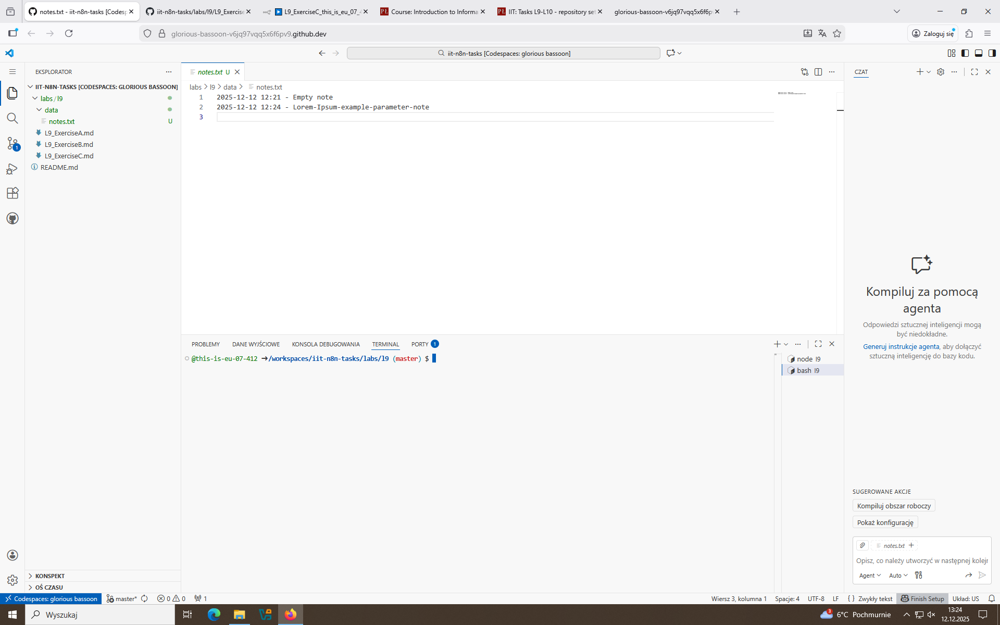
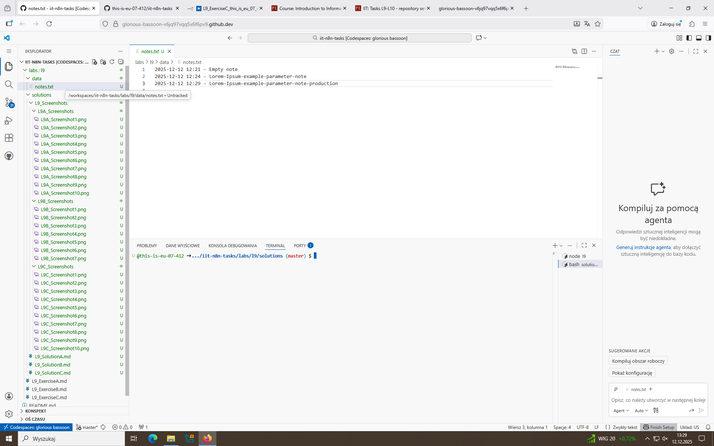

# Labolatories Week 9: Task C

## 1. Creating the workflow

- All the same, but this time also created a directory data inside the path from which I run n8n. 

## 2. Setting up the nodes

- As before, webhook waits until it's path is access, passing the GET 'note' value further, which is processed by Java Script from JSON into binary (in form of plain text), then passed to write to a disk node, which appends that text into notes.txt file. If that operation is successful, respond to webhook node returns http code 200 with some JSON info.

## 3. Testing

-   First write on webhook-test: browser view then file view from codespace.

-   Second write on webhook-test: browser view then file view from codespace.

-   Third write, this time on active webhook: browser view then file view from codespace. Data which was appended to the file before (on webhook-test) is still here, since it's still the same file.

